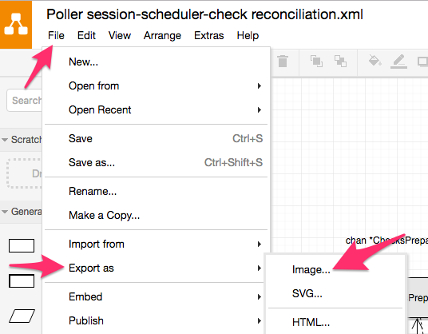
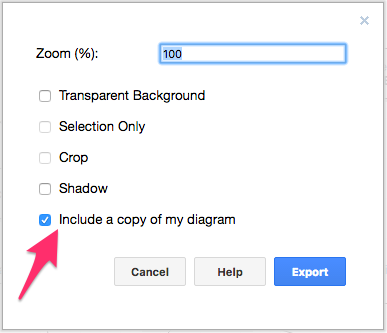

This directory contains various design and supporting documentation for the 
[Rackspace Monitoring Poller](https://github.com/racker/rackspace-monitoring-poller).

## Draw.io Diagrams

The diagrams in this directory that are in PNG format can be edited with [Draw.io](https://www.draw.io/). The native
format of Draw.io is XML; however, it has a feature to export a PNG with the XML diagram embedded within it. 
 
For example, to edit the diagram [Poller session-scheduler-check reconciliation.png](Poller session-scheduler-check reconciliation.png),
choose the option to "open from device" and select that `png` file. Before committing the updated documented, be sure
to re-export the image with embedded document from File > Export as > Image, as shown here:

Be sure to leave the option "Include a copy of my diagram" enabled before clicking "Export", as shown here:

## Generated documents

Some of the files in this directory are generated from either another source document in this directory or
from the the poller source code itself.

### Call graphs

The files `*_callgraph.{dot,png}` are generated by interpreting the repository's code base with the 
[go-callcvis](https://github.com/TrueFurby/go-callvis) tool. Rather than use that tool directly, the
callgraph diagrams can be (and should be upon any major code changes) re-generated by running:

    cd $GOPATH/src/github.com/racker/rackspace-monitoring-poller
    contrib/generate-callgraphs.sh

### Swagger / OpenAPI

Even though the poller-endpoint communication utilizes a line-oriented, JSON streaming protocol, that interaction
is modelled as an [OpenAPI (fka Swagger 2.0)](https://github.com/OAI/OpenAPI-Specification/blob/master/versions/2.0.md) 
specification, [poller-api.yml](poller-api.yml). Any YAML editor can be used to edit the specification file; however,
it is highly recommended to use a Swagger 2.0 aware tool such as [the online editor](http://editor.swagger.io/#/) or
an IDE plugin.

The `*-api.adoc` files are generated from the corresponding `yml` file using the 
[swagger2markup-cli tool](https://github.com/Swagger2Markup/swagger2markup-cli). For example, with the CLI jar
downloaded, the `poller-api.adoc` can be re-generated using:

    java -jar ~/Downloads/swagger2markup-cli-1.2.0.jar convert -i poller-api.yml -f poller-api